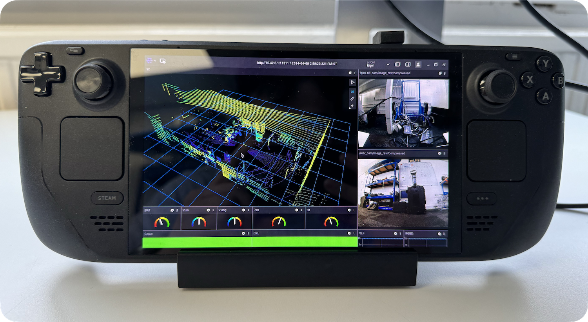

# Table of Contents
- [Native Ubuntu installation](#native-ubuntu-installation)
- [Prepare SteamOS](#prepare-steamos)
- [ROS and ROS2](#ros-and-ros2)
  * [1. Native installation](#1-native-installation)
  * [2. Robostack](#2-robostack)
- [Using Robostack ROS](#using-robostack-ros)
  * [ROS packages](#ros-packages)
- [Foxglove Studio](#foxglove-studio)



# ROS-for-Steam-Deck-OLED

#### Native Ubuntu?
OLED does not support Ubuntu, at least none of the LTS versions from 16.04 to 22.04. After unsuccessful attempts of installing Ubuntu on SDO, we resolve to relying on the original SteamOS which is a modified Arch Linux system.

## Prepare SteamOS
1. Set a root password
```sh
passwd
```

2. Disable read only file system
```sh
steamos-readonly disable
```

3. Configue pacman
```sh
sudo pacman-key --init
sudo pacman-key --populate archlinux
```

4. Trust all signiture
This is a dangerous move but it seems there is no other way around (I am not an expert in Linux though). Without trust all package signitures, you can't use pacman to install anything. Just be careful with what you are installing.

This can be done by setting `SigLevel` to `TrustAll` in /etc/pacman.conf.
```sh
sudo sed 's/SigLevel.*/SigLevel = TrustAll/g;' /etc/pacman.conf
```

5. (optional) Install VS code
```sh
sudo pacman -Sy code
```

6. (optional) Install Yay
The latest Yay (12.3.5 at the time of writing) does not work with SteamOS. Instead, we can use 12.3.1.
```sh
git clone https://aur.archlinux.org/yay.git
cd yay
git checkout 17f4503492f5070ebcca58743144773c89099dff
git show -s --format=%s HEAD # make sure it says 12.3.1
makepkg -si
```

7. (optional) Boot straight into desktop
```
/usr/bin/steamos-session-select plasma-wayland-persistent
```
To reverse it
```
/usr/bin/steamos-session-select gamescope
```

## ROS and ROS2
You have at least two options to run ROS/ROS2 on SteamOS: 

1. a native installation;
2. a stack envrionment using conda.
 
We prefer the **second** approach as it is safe and flexible.

### 1. Native installation
Warning: your milage may vary, especially after Arch linux and/or SteamOS update.

We have successfully installed ROS2 humble using yay:
```sh
yay ros2-humble -S
```

We have not had success with ROS1 noetic however.

### 2. Robostack
Robostack is a bundling of ROS packages for various operating system using the conda package manager. It provides an easy approach to install ROS on non-natively supported OS, including SteamOS. Currently Robostack only support ROS1 noetic and ROS2 humble. Details can be found on [their website](https://robostack.github.io).

First we need to install miniconda
```sh
mkdir -p ~/miniconda3
wget https://repo.anaconda.com/miniconda/Miniconda3-latest-Linux-x86_64.sh -O ~/miniconda3/miniconda.sh
bash ~/miniconda3/miniconda.sh -b -u -p ~/miniconda3
rm -rf ~/miniconda3/miniconda.sh
```

Next, you can follow the steps on [Robostack/GettingStarted](https://robostack.github.io/GettingStarted.html#__tabbed_1_1). For sake of completion, I have included an example of installing ROS Noetic.
1. Install mamba
```sh
conda install mamba -c conda-forge
```

2. Create and configure a ROS environment
```sh
mamba create -n noetic_env
mamba activate noetic_env

# this adds the conda-forge channel to the new created environment configuration 
conda config --env --add channels conda-forge
# and the robostack channel
conda config --env --add channels robostack-staging
# remove the defaults channel just in case, this might return an error if it is not in the list which is ok
conda config --env --remove channels defaults
```

3. Install ROS noetic
```sh
mamba install ros-noetic-desktop
```

4. Re-activate the environment to initialise ROS.
```sh
mamba deactivate
mamba activate noetic_env
```

That's it.

## Using Robostack ROS
You need to first activate the envrionment.
```sh
mamba activate noetic_env
```
After this, you can source your workspace, export ROS_MASTER_URI etc., and use ROS commands as if you were using Ubuntu, e.g. `roscore`, `roslaunch`, etc. Graphics interfaces such as `rviz` and `rqt` also work well.

### ROS packages
There are a limited number of packages that can be directly installed. You can find a list of packages on their website, e.g. [Available Packages/ROS1 Noetic](https://robostack.github.io/noetic.html). Note that new packages will be added over time.

To install packages:
```sh
mamba install ros-noetic-velodyne
```

To update:
```sh
mamba update --all
```

You can also use `catkin_make` to build and install any unlisted packages like what you do in Ubuntu.

## Foxglove Studio
[Foxglove Studio](https://app.foxglove.dev) is a visulisation tool that can be used instead of RVIZ and with the added benefit of not requiring any ROS installation or envrionment. Unless you plan to use the software in a large team with a lot of teamwise co-operation, it is free-of-charge.

The latest Foxglove package from Arch linux repository, at the time of writing, was outdated. To install the latest version (2.0.1) at the time, we have to pull it from the official website:
```sh
mkdir foxglove-studio-bin
cd foxglove-studio-bin
wget https://raw.githubusercontent.com/ICE9-Robotics/ROS-for-Steam-Deck-OLED/main/files/pkgbuild_foxglove -O PKGBUILD
makepkg -si
```

You can download a newer version, if it is available, by updating the `pkgver` parameter in [pkgbuild_foxglove](files/pkgbuild_foxglove) and rename the file to `PKGBUILD`, followed by running the `makepkg -si` command within the same directory of the file.

----
<sup>Table of contents generated with <a href='http://ecotrust-canada.github.io/markdown-toc/'>markdown-toc</a></sup>
